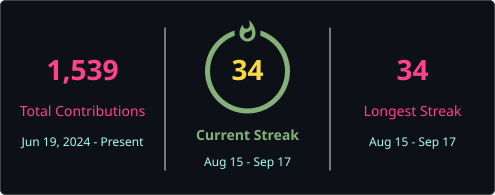

# 👋 Hi! I'm Thang

  

<table border="0" width="100%">
  <tr>
    <td width="45%" valign="top">
      <h3>🛠 Tech Stack</h3>
      <h4>📚 Languages</h4>
       
      
      
       
      
       
      
      
       
      <h4>🚀 Frameworks & Technologies</h4>
      
       
       
       
      
      
      
       
       
      <h4>💾 Databases</h4>
      
      
       
      <h4>🛠 Tools & Platforms</h4>
       
       
      
       
       
      
       
      <h3>📫 Contact</h3>
      
       
      
    </td>
    <td width="55%" valign="top" align="center">
      <h3>📊 Skills & Activity</h3>
      
       
      
       
      
    </td>
  </tr>
  <tr>
    <td colspan="2" align="center" valign="top">
      
       
      
       
    </td>
  </tr>
</table>

  ⭐ If you find this profile useful, please consider giving it a star. ⭐

